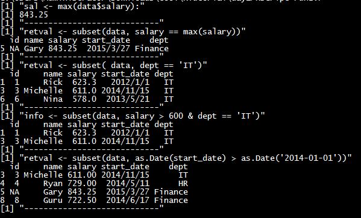

**R语言可以读取和写入 csv 格式的文件**

看完本课后，你将会学到：

1. 使用R语言，从 **csv文件** 读取数据。
2. 然后将 R语言中的 **数据** 写入 **csv文件** 中。 

# 实验开始 #
----------

**第一步：**

手工创建一个表格

按照图中的格式输入。或者你自己输入内容。

----------

**第二步：**

把这个文件保存起来，文件名保存为：  `input.csv`

然后，你就会看到这个东西：

----------

**第三步：**

打开记事本，输入以下内容：

    data <- read.csv("input.csv")
	print(data)

----------

**第四步：**

把文件保存起来，文件名字叫做：  `run.r`

----------

**第五步：**

点击运行本目录下面的 `run.bat` 文件。

你会看到这个

----------

**第六步：**

分析代码：

    data <- read.csv("input.csv")
	print(data)

1. **read** 在英文中的意思是：**读取** 的意思。
2. **read.csv** 的意思是：读取 **csv** 文件，
3. **read.csv("input.csv")** 的意思就是：读取一个名叫 **input.csv** 的文件。
4. **data <- read.csv("input.csv")**  的意思就是：将 **input.csv** 读取出来后，放到一个名字为 **data** 的变量上。
5. **print(data)**  这个意思是：将存有数据的 data 变量显示打印在屏幕上。 print 用英文表示的意思就是： 打印的意思。

分析完毕。

----------

**第七步：**

修改代码：
打开记事本，输入以下内容：

	data <- read.csv("input.csv")
	print(data)
	
	print(is.data.frame(data))
	print(ncol(data))
	print(nrow(data))

----------

**第八步：**

把文件保存起来，文件名字叫做：  `run1.r`

----------

**第九步：**

点击运行本目录下面的 `run1.bat` 文件。

你会看到这个

----------

**第十步：**

分析代码：

	data <- read.csv("input.csv")
	print(data)
	
	print(is.data.frame(data))
	print(ncol(data))
	print(nrow(data))

1. 在英文中， is data frame 的大概意思是： **data** 是不是 **frame** 格式。**frame** 是表框的意思。
2. 所以 `is.data.frame(data)` 的意思就是：括号中这个存有的 data 变量，是不是表格数据。打印出来的结果是：**TRUE** 。 **TRUE** 就是正确的意思。
3. `print(ncol(data))` 的意思就是 data 中的表格数据 ，从左到右算，总共有5列。
4. `print(nrow(data))` 的意思就是 data 中的表格数据 ，从上到下算，总共有3行。

**如图：**

----------

**第十一步：**

创建了一个新的csv文件， 

名字保存为：`input1.csv`

----------

**第十二步：**

打开记事本，输入以下内容：

    data <- read.csv("input1.csv")

	sal <- max(data$salary)
	print(sal)

----------

**第十三步：**

把文件保存起来，文件名字叫做：  `run2.r`

----------

**第十四步：**

点击运行本目录下面的 `run2.bat` 文件。

你会看到这个

----------

**第十五步：**

分析代码：

    data <- read.csv("input1.csv")

	sal <- max(data$salary)
	print(sal)

`max` 是 **最大** 的意思, 所以 `sal <- max(data$salary)`  的意思是：在 salary 这一列中，如果全是数字，就在这些数字中找出最大的数字出来。并存到一个叫 `sal` 的变量中。

----------

第一课学习完毕。