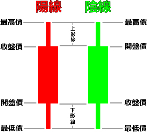

## 简单学会看各类金融指标 ##

**回顾第一阶段的学习内容：**

- **创建自己的git开源仓库**
- **创建第一个py文件**
- **构建自己的函数包**

----------

**第二阶段内容：**

- **股票与期货的基础知识**
- 简单学会看各类金融指标
- python的基础语法
- 了解html的结构
- 使用python抓取html文档

**第三阶段内容：**

- 介绍一些金融数据源
- 学习期权基础知识
- 开始用python抓取数据
- 设计数据库存放金融数据
- 将抓取后的python数据储存到数据库中
- 用python统计数据库中的数据

**第四阶段内容：**

- 设计更加精细化的数据模型
- 了解全球各大交易所的基本情况
- 第三方金融数据服务商平台
- 市场规则简介
- 一些数学公式的手工实现
- 搭建自己专属的金融数据研究实验室
- 撰写自己项目的研究白皮书

----------

让我们现在开始学习：**简单学会看各类金融指标**

## 简单理解K线图 ##

据传K线为日本江户时代的白米商人本间宗久所发明，用来记录每日的米市行情，研析期货市场，当时称为“蜡烛足（日语：ローソク足）”。不过是否真为本间宗久本人发明仍有疑问，也有托名之说，皆有待考证。

K线（Candlestick chart）又称“阴阳烛”，是反映价格走势的一种图线，其特色在于一个线段内记录了多项讯息，相当易读易懂且实用有效，广泛用于股票、期货、贵金属、数字货币等行情的技术分析，称为K线分析。

上图有两根蜡烛图，左边或者右边的蜡烛图，都可以分别代表两个时间段的开盘价，收盘价，最高价，最低价。

暂时简单的技术金融指标就只有聊这么多。