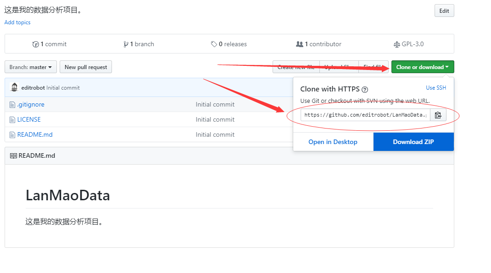
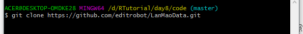
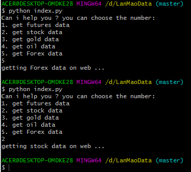
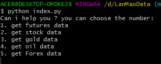
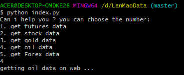

## python的基础语法 ##

**回顾第一阶段的学习内容：**

- **创建自己的git开源仓库**
- **创建第一个py文件**
- **构建自己的函数包**

----------

**第二阶段内容：**

- **股票与期货的基础知识**
- **简单学会看各类金融指标**
- python的基础语法
- 了解html的结构
- 使用python抓取html文档

**第三阶段内容：**

- 介绍一些金融数据源
- 学习期权基础知识
- 开始用python抓取数据
- 设计数据库存放金融数据
- 将抓取后的python数据储存到数据库中
- 用python统计数据库中的数据

**第四阶段内容：**

- 设计更加精细化的数据模型
- 了解全球各大交易所的基本情况
- 第三方金融数据服务商平台
- 市场规则简介
- 一些数学公式的手工实现
- 搭建自己专属的金融数据研究实验室
- 撰写自己项目的研究白皮书

----------

让我们现在开始学习：**python的基础语法**

我们回顾一复习一下上次的python内容。并且把python的基础语法学一部分。

1. **创建自己的git开源仓库**
1. **创建第一个py文件**
1. **构建自己的函数包**
1. 基础语法

----------

## 一：创建自己的git开源仓库 ##

第一步：登陆自己的github账号。

    https://github.com/

----------

第二步：新建一个新的项目仓库

----------

第三步：填写项目基础资料

> 在 **Repository name** 下方的输入框写入基础资料。
> 
> 在 **Description (optional)** 下方的输入框写入项目的基础介绍。
> 
> 在 **Initialize this repository with a README** 的地方 打上勾。

**参考下图:**

项目创建完毕!

----------

第四步： 将项目加载到本地

当项目创建完成后，你会看到如下图。按照箭头指示依次点击按钮，把圆圈中的链接复制一下。

接着，在电脑的一个空白的文件夹上右键 选择 “git base here”。

会看到启动了一个命令行，接着输入：git clone (此处粘贴上刚才复制的链接)

类似下图的命令行

接着回车，就会看到，项目已经同步到本地电脑硬盘上了。

----------

## 二：创建第一个py文件 ##

为了让你顺便学习一下命令行的知识，所以我们直接使用命令行来创建。
刚才我们把git上面的内容已经全部下载到本地电脑了。

**第一步**：

我们打开刚才的 **LanMaoData** 文件夹。

**第二步**：

我们现在右键，选择 “git base here”。现在看到了一个命令行。

**第三步**：

输入 `ls -la`，回车。 这个命令的意思是：展示出当前文件夹上的所有文件。

我们看一下，刚才同步到电脑端的文件夹的目前的文件列表。

- /.git
- .gitignore
- LICENSE
- README.md

*四个文件的解释：*

1. `/.git` 第一个是一个文件夹，比较重要，不能删，以后告诉你它的用途。
1. `.gitignore` 第二个是一个文件，可以用记事本打开，也很重要，最好别删，以后告诉你它的用途。
1. `LICENSE` 第三个是一个文件，可以用记事本打开，写着一个关于开源协议的内容，以后我们再来解释。
1. `README.md` 第四个是一个文件，可以用记事本打开，上面没有什么内容，我们可以在这个文件上写一些文件说明。

**第四步**：

现在，我们在这个文件夹下面，新建一个**py文件**，也就是 **python** 脚本。

输入： `echo > index.py`
回车
就这样，一个名为：**index.py** 的 空文件 就这样被创建出来了。

我们现在看一下列表: 输入 `ls -la`，回车。如下

- /.git
- .gitignore
- LICENSE
- README.md
- index.py

使用记事本打开发现，**index.py** 这个文件里面什么内容也没有。接下来，我们让它能够运行。

**第五步**：

刚才用记事本打开这个文件后，开始输入以下代码：

    #! python3
    #encoding: utf-8
    # -*- coding: utf-8 -*-
    
    if __name__=='__main__':
    	print("hello")

保存。

**第六步**：

运行 **index.py** ，输入： `python index.py`

看一下有什么结果。

**第七步**：

代码解析，

第一行： `#! python3`
这个告诉解析器，指定 使用python3版本的解析器进行运行。

第二行： `#encoding: utf-8`

第三行： `# -*- coding: utf-8 -*-`

这两行，告诉解析器，该文件里面的内容，指定使用 utf-8 的字符格式进行保存和展示。

第四行： `if __name__=='__main__':`

这一行是真正的 **python 代码** ，这个后面再详细解释。它的作用只是判断它自己目前的运行状态是一个包调用，还是命令行运行。

第五行： `print("hello")`

*参考代码在此处：*

https://github.com/editrobot/LanMaoData

----------

## 三：构建自己的函数包 ##

刚才已经完成了关于基础测试代码的编写，现在来了解一下如何开发自己的函数包。

我们现在设计1个函数包，专门将一个字符 **a** 和 字符 **b** 合并起来。 变成：**ab**

**操作步骤**

----------

**第一步：**

在刚才的命令行里输入：`mkdir linkstr` 回车执行。

`mkdir linkstr`的意思是：创建一个叫 **linkstr** 的文件夹。

结果现在的文件目录结构像这样：

- /.git
- /linkstr
- .gitignore
- LICENSE
- README.md
- index.py

----------

**第二步：**

输入：`cd linkstr` 回车执行。
意思是：进入到 **linkstr** 这个目录里面。

----------

**第三步：**

输入：`echo >__init__.py` 回车执行。

> 注意：

    __init__.py 这个文件名 前面和后面的下划线 _ 是有2个的。 

`echo >__init__.py` 的意思是：创建一个 `__init__.py` 文件。

结果现在的文件目录结构像这样：

- /.git
- /linkstr
	- `__init__.py`
- .gitignore
- LICENSE
- README.md
- index.py

----------

**第四步：**

用记事本打开 `__init__.py` ，这个文件现在什么内容也没有，一片空白，
所以，将以下代码粘贴上去。

	#! python3
    #encoding: utf-8
    # -*- coding: utf-8 -*-
    
    __author__ = 'LanMaoData'

**代码解析**

**第一行**： `#! python3`
这个告诉解析器，指定 使用python3版本的解析器进行运行。

**第二行**： `#encoding: utf-8`

**第三行**： `# -*- coding: utf-8 -*-`

这两行，告诉解析器，该文件里面的内容，指定使用 utf-8 的字符格式进行保存和展示。

**第四行**： `__author__ = 'LanMaoData'`

这一行是说明：这个包的作者叫：**LanMaoData**

到了这里，一个python 的空包就这样设计好了。以后设计python的函数包都是这样的结构。

复习一遍：新增一个包的顺序。

1. 创建一个文件夹。
2. 在文件夹下面新增一个文件，名字固定为：`__init__.py`
3. 在 `__init__.py`里面写上第四步的基础内容

一个包就这样完成了。接下来，我们往这个包里面添加一个刚才说需要新增的功能。

----------

**第五步：**

输入：`echo >linkab.py` 回车执行。

`echo >linkab.py` 的意思是：创建一个 `linkab.py` 文件。

> 注意: 名字可以随便命名，例如： `ok.py` , `hello.py` 这些都可以的。

用记事本打开 `linkab.py` ，这个文件现在什么内容也没有，一片空白，
所以，将以下代码粘贴上去。

	#! python3
	#encoding: utf-8
	# -*- coding: utf-8 -*-
	
	def linkfun(a,b):
		return a+b

**代码解析**

**直接看第四行**： 

	def linkfun(a,b):
	    return a+b

这个告诉解析器，在包里面创建一个叫 **linkfun** 的函数。

这个函数接受两个变量，分别是：**a，b**

就这样，一个简单的包，就已经设计好了。现在我们需要学会来使用它。

----------

**第六步：**

我们再把 `index.py` 这个文件用记事本打开修改一下。

原来的代码是：

	#! python3
	#encoding: utf-8
	# -*- coding: utf-8 -*-
	
	if __name__=='__main__':
		print("hello")

修改成如下：

	#! python3
	#encoding: utf-8
	# -*- coding: utf-8 -*-
	
	from linkstr import linkab
	
	if __name__=='__main__':
		result = linkab.linkfun("aaa","b")
		print(result)

代码解析:

    from linkstr import linkab

这句的意思是： 将 **linkstr** 这个包文件夹里面的 linkab.py 加载进来。

	result = linkab.linkfun("aaa","b")

这句的意思是：执行 linkab.py里面的 linkfun 函数，并把结果存在 result 变量中。

	print(result)

最后把结果打印出来。

**第七步：**

我们输入一下： `pwd` ，回车。结果打印出来，有没有发现，现在我们正处于包的文件夹中。我们要离开这个文件夹，回到上一级文件夹中。

所以，输入： `cd ..` ，回车。ok了。我们现在回到 `index.py` 这个文件夹里面了。

输入： `python index.py` ，回车。

看一下结果是不是成功了。

*参考代码在此处：*

https://github.com/editrobot/LanMaoData

----------

## 四：基础语法 ##

现在，我们需要开始通过对这个项目添加一些爬虫功能，来完善这个项目。

效果就像这个图：

翻译：

	Can i help you ? you can choose the number:
	我能如何为您服务？请选择下面的数字

	1. get futures data
	1. 获取期货数据

	2. get stock data
	2. 获取股票数据

	3. get gold data
	3. 获取黄金价格数据

	4. get oil data
	4. 获取石油行情数据

	5. get Forex data
	5. 获取外汇数据

**第一步：**

我们再把 `index.py` 这个文件用记事本打开修改一下。

原来的代码是：

	#! python3
	#encoding: utf-8
	# -*- coding: utf-8 -*-
	
	from linkstr import linkab
	
	if __name__=='__main__':
		result = linkab.linkfun("aaa","b")
		print(result)

修改成如下：

	#! python3
	#encoding: utf-8
	# -*- coding: utf-8 -*-
	
	if __name__ == '__main__':
		print("Can i help you ? you can choose the number:")
	
		print("1. get futures data")
		print("2. get stock data")
		print("3. get gold data")
		print("4. get oil data")
		print("5. get Forex data")
	
		dosomethink = input("")
	
		if dosomethink == "1":
			print('getting futures data on web ...')
		elif dosomethink == "2":
			print('getting stock data on web ...')
		elif dosomethink == "3":
			print('getting gold data on web ...')
		elif dosomethink == "4":
			print('getting oil data on web ...')
		else:
			print('getting Forex data on web ...')

接着，在命令行里输入： `python index.py` ，回车。

随便输入一个数字，比如输入：4，接着回车。如下图：

以上的代码，是假装在网上抓取一些金融行情价格资料。实际上，为了让学习更加容易，我们真实的爬虫代码要在后面才逐渐学习后，才贴出来。

代码解析:

    dosomethink = input("")

这句的意思是： Python 中 input() 函数接受一个电脑键盘输入数据，返回为 字符串类型的值赋予 dosomethink这个变量中。

	if dosomethink == "1":
		print('getting futures data on web ...')

这句的意思是：如果dosomethink的变量等于 1，那么就打印显示：getting futures data on web ...

	elif dosomethink == "2":
		print('getting stock data on web ...')

这句的意思是：如果dosomethink的变量等于 2，那么就打印显示：getting stock data on web ...

	elif dosomethink == "3":
		print('getting gold data on web ...')

这句的意思是：如果dosomethink的变量等于 3，那么就打印显示：getting gold data on web ...

	elif dosomethink == "4":
		print('getting oil data on web ...')

这句的意思是：如果dosomethink的变量等于 4，那么就打印显示：getting oil data on web ...

	else:
		print('getting Forex data on web ...')

这句的意思是：如果dosomethink的变量以上的都不是，那么就打印显示：getting Forex data on web ...

本课完毕。这一次，我们开始已经在写自己的金融数据项目了。接下来，就会逐渐完善和丰富这个项目的代码功能，让它更加强大和专业。

*参考代码在此处：*

https://github.com/editrobot/LanMaoData