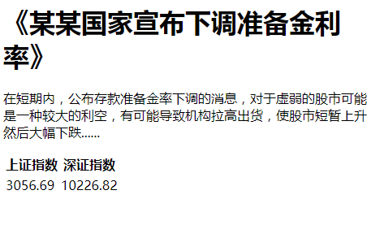

## python的基础语法 ##

**回顾第一阶段的学习内容：**

- **创建自己的git开源仓库**
- **创建第一个py文件**
- **构建自己的函数包**

----------

**第二阶段内容：**

- **股票与期货的基础知识**
- **简单学会看各类金融指标**
- **python的基础语法**
- 了解html的结构
- 使用python抓取html文档

**第三阶段内容：**

- 介绍一些金融数据源
- 学习期权基础知识
- 开始用python抓取数据
- 设计数据库存放金融数据
- 将抓取后的python数据储存到数据库中
- 用python统计数据库中的数据

**第四阶段内容：**

- 设计更加精细化的数据模型
- 了解全球各大交易所的基本情况
- 第三方金融数据服务商平台
- 市场规则简介
- 一些数学公式的手工实现
- 搭建自己专属的金融数据研究实验室
- 撰写自己项目的研究白皮书

----------

让我们现在开始学习：**了解html的结构**

    <html>
		<head>
			<title>国际新闻网</title>
		</head>
	    <body>
	    
		    <h1>《某某国家宣布下调准备金利率》</h1>
		    
		    
在短期内，公布存款准备金率下调的消息，对于虚弱的股市可能是一种较大的利空，有可能导致机构拉高出货，使股市短暂上升然后大幅下跌......

		
			<table>
				<tr><th>上证指数</th><th>深证指数</th></tr>
				<tr><td>3056.69</td><td>10226.82</td></tr>
			</table>
	    
	    </body>
    </html>

我们如果后面写爬虫程序，基本都会接触到以上的网页结构。
因为，不是学习网页制作，所以，不用学习上面的语法功能，但是需要了解整体结构，了解就可以。这样才可以让自己知道抓取哪些必要的关键数据，哪些是不相关的垃圾数据。

本代码可以在 **code** 文件夹里面看到。可以先用电脑的浏览器打开看一下展示效果。

----------

----------

如上图。

**本节目标：**

通过这一节，我们对html标签的分析和归纳，来了解上面这一坨乱糟糟的字符的潜在规律。设计一个爬虫方案。

方便下一节，我们利用本节设计好的方案蓝图，通过用python手工输入代码，把上面这一坨乱糟糟的字符自动整理，接着找出它们的展示规律，再把我们所需要的内容整理和过滤出来。

> 提示：这个小节，属于一种数据筛选和过滤，粗处理的环节。后面，爬虫需要爬取的数据规模，更加庞大以及复杂。所以，这一小节比较重要。

我们将不使用，任何第三方的爬虫包，通过自力更生。自己设计一个正儿八经的python爬虫包。

**步骤：**

1. 代码整体分析
1. 找出标签的规则
1. 提取目标数据
1. 生成目标格式

**代码整体分析：**

要注意一个关键点：在 `<body>` 和 `</body>` 的中间，都是属于有用的内容，

    <h1>《某某国家宣布下调准备金利率》</h1>
    
    
在短期内，公布存款准备金率下调的消息，对于虚弱的股市可能是一种较大的利空，有可能导致机构拉高出货，使股市短暂上升然后大幅下跌......

    
    <table>
	    <tr><th>上证指数</th><th>深证指数</th></tr>
	    <tr><td>3056.69</td><td>10226.82</td></tr>
    </table>

我们的目标是需要将里面有用的文字提取出来，把类似 `<h1>` `</h1>` `
` `
` `<table>` `</table>` `<tr>` `</tr>` `<th>` `</th>` `<td>` `</td>` 这些不相关的内容去掉。

**找出标签的规则：**

做了一下统计，上面的代码有以下这些标签。

- `<h1>`
- `</h1>`
- `
`
- `
`
- `<table>`
- `</table>`
- `<tr>`
- `</tr>`
- `<th>`
- `</th>`
- `<td>`
- `</td>`

他们都有一个规律，就是：前面有一个 `<`， 后面有一个 `>`。 这就是它们的基础规律。

**提取目标数据：**

根据上面分析出来的规律，现在的步骤是，用上面分析出来的规律，给它们排个队。

	1.  <h1>
	2.  《某某国家宣布下调准备金利率》
	3.  </h1>
	4.  

	5.  在短期内，公布存款准备金率下调的消息，对于虚弱的股市可能是一种较大的利空，有可能导致机构拉高出货，使股市短暂上升然后大幅下跌......
	6.  

	7.  <table>
	8.  <tr>
	9.  <th>
	10.  上证指数
	11.  </th>
	12.  <th>
	13.  深证指数
	14.  </th>
	15.  </tr>
	16.  <tr>
	17.  <td>
	18.  3056.69
	19.  </td>
	20.  <td>
	21.  10226.82
	22.  </td>
	23.  </tr>
	24.  </table>

**提取目标数据：**

平时，有一些金融交易员会经常看新闻，来评估现在的行情会如何变化。每天，这个网页的新闻都会变化，例如像上面那段话

    在短期内，公布存款准备金率下调的消息，对于虚弱的股市可能是一种较大的利空，有可能导致机构拉高出货，使股市短暂上升然后大幅下跌......

一天一篇新闻报道，手工来分析这段新闻就真是太累了，也太费劲了。

那么就可以直接用爬虫，指定每天自动抓取这个位置的文字，来进行人工智能系统来进行分析。

如何告诉机器自动抓取这个位置的摘要新闻呢？突然发现，在这段新闻的前一个位置，有一个`
`符号。这个是网页的排版代码，所以，现在判定了。python 可以先寻找 `
` 到底在哪里，只要找到了
 `
` ，那么这个符号的后面一定是我们需要的实时新闻的内容。这样就可以把这些汉字，一个一个取出来，直到发现 `
` 这个符号，再停止取数据。其他的数据，比如上证指数，深证指数，也可以通过同样的方法得到结果。

**生成目标格式：**

可以通过分析整个 html 网页的内容，来将其转成其他格式的数据结构，可以称为：**数据结构化**
。

如下：

	{
		"title":"《某某国家宣布下调准备金利率》",
		"description":"在短期内，公布存款准备金率下调的消息，对于虚弱的股市可能是一种较大的利空，有可能导致机构拉高出货，使股市短暂上升然后大幅下跌......",
		"data":{
			"shenzheng":10226.82,
			"shangzheng":3056.69,
		}
	}

并且把这个修改后的数据导出成为 **result.json** 文件，这个文件存放在 **code** 文件夹中，可以打开参考一下。

具体实践的代码，请等待下一节。

*参考代码在此处：*

https://github.com/editrobot/LanMaoData