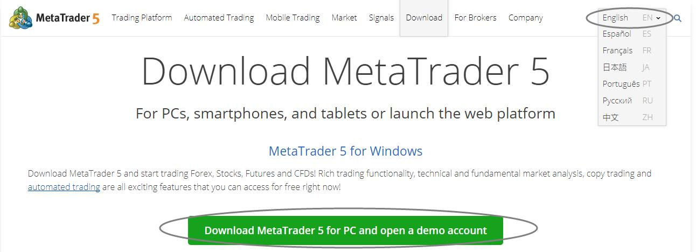
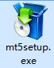
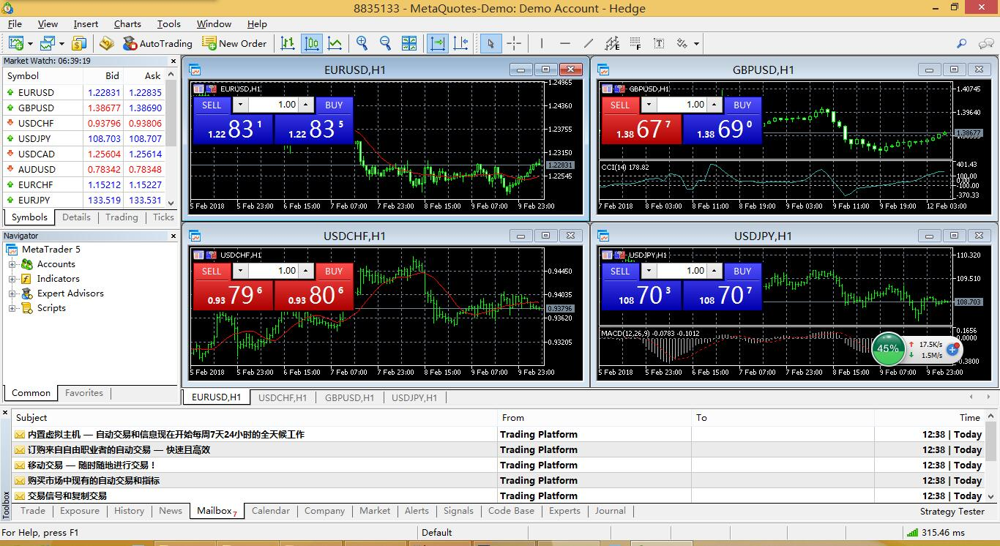
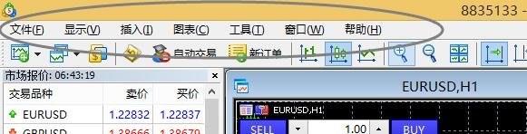
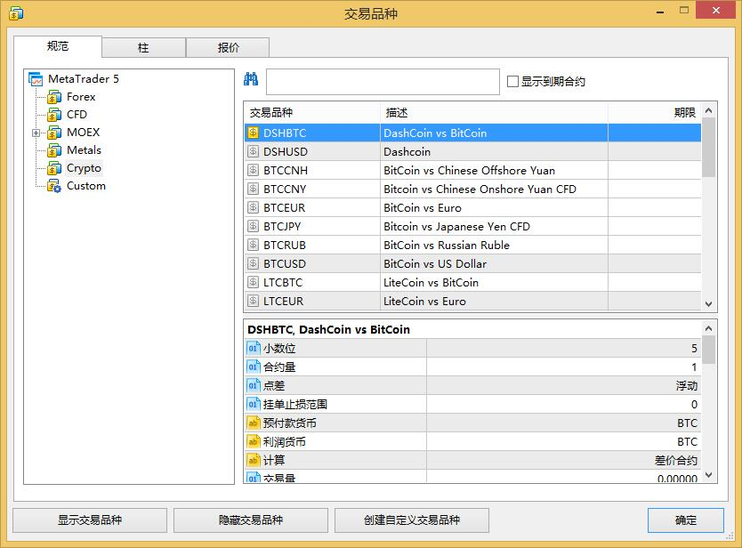
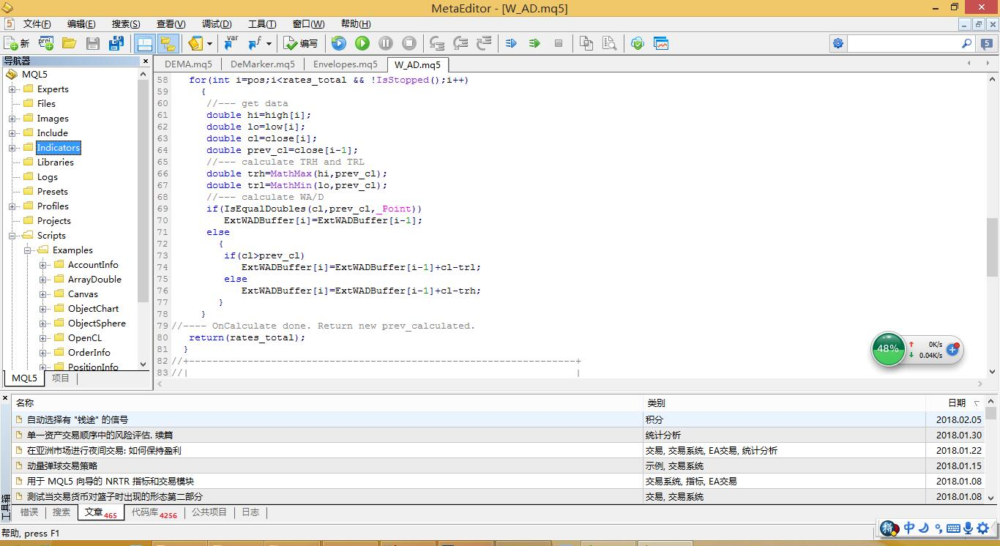

## 开始搭建 MetaQuotes 系列的量化平台 ##

下载地址： https://www.metatrader5.com/

**介绍：**

> MT5 全称：MetaTrade 5 。 它是由MetaQuotes platform（迈达克）公司编写的一款外汇、期货等金融产品的交易软件。
> 
> MT5交易平台能够提供更多的金融产品。除了贵金属、外汇、期货外，它还可提供股票、期权等金融投资产品的实时行情和交易，交易的产品更加多样化。
> 
> 其次，MT5交易平台提供的功能更强大。除了提供各种投资产品的实时行情和交易外，它还提供4种缩放模式、19种画线工具、21个交易时段图表选项、38种国际流行的技术指标和39种图像对象，交易功能有明显的提升。

下载安装：

**我们会下载到这个软件双击运行它：**

首先，你会看到这么一个界面。

**我们会看到上面一排菜单：**

我们现在要了解这个菜单里两个关键的工具：

1.多品种交易行情图表查看依次点击：

**显示** -> **交易品种** 

就可以看到各个品种的金融产品，上面还有比特币的行情交易。

2.MQL交易语言编辑器依次点击：

**工具** -> **MetaQuotes语言编辑器**

你会看到这个，它有什么用处呢？

就是你可以编写相应的脚本来进行简单交易，或者通过编写DLL工具来接入各种系统或者其他开发语言进行通讯，比如：R或者python或者c/c++，nodejs来进行自动化交易系统的搭建。或者mysql数据库的操作。

顺便看一下 run.r的代码。