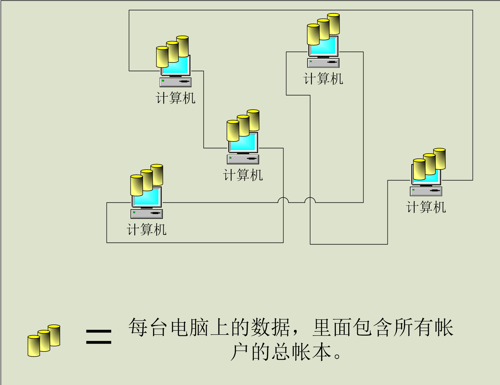
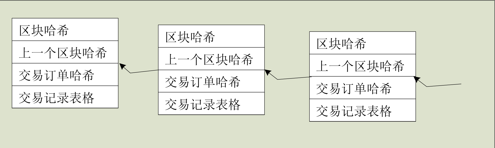

# 比特币初探 #

一些比特币的琐碎故事，我就不多说了。直接切入正题。

比特币是基于区块链的技术，所以，分为：区块和链 2种。

一般情况下，每个人如果要花费比特币，都要现在自己的电脑上安装一个自己的比特币钱包。

钱包客户端的下载链接：

- https://wallet.bitcoin.com/
- https://bitcoin.org/en/choose-your-wallet

----------

## 如何使用比特币 ##

**引言**

> Bitcoin is different than what you know and use every day. Before you start using Bitcoin, there are a few things that you need to know in order to use it securely and avoid common pitfalls.

比特币与你以前所了解的常识有所不同，当你要开始了解并且使用比特币之前，我先告诉你一些常见的安全操作，避免产生后续的失误。

**正文**

> If you are about to explore Bitcoin, there are a few things you should know. Bitcoin lets you exchange money in a different way than with usual banks. As such, you should take time to inform yourself before using Bitcoin for any serious transaction. Bitcoin should be treated with the same care as your regular wallet, or even more in some cases!

在开始研究比特币之前，先告诉你一些少量的必备常识。平时，你要汇款给别人的话，需要通过银行进行操作，但使用比特币的话，却有些不一样。所以，在使用比特币做任何交易的时候，你要花点时间吸收一下相关知识点。甚至在这方面多花点关注。这对你是有好处的。

> Securing your wallet
> 
> Like in real life, your wallet must be secured. Bitcoin makes it possible to transfer value anywhere in a very easy way and it allows you to be in control of your money. Such great features also come with great security concerns. At the same time, Bitcoin can provide very high levels of security if used correctly. Always remember that it is your responsibility to adopt good practices in order to protect your money.

保护好你的钱包。

现实生活中，你的钱包平时都需要放在安全的地方。而比特币却使得你可以随时随地汇款,以及自由支配自己的钱财。但是这些强大的功能，也使我们面对一些安全隐患。这个时候，如果能够正确地操作，那么你就可以更安全地，保护好你的财富。切记，采取正确的操作方式，来确保你的资金财产安全。

> Bitcoin price is volatile
> 
> The price of a bitcoin can unpredictably increase or decrease over a short period of time due to its young economy, novel nature, and sometimes illiquid markets. Consequently, keeping your savings with Bitcoin is not recommended at this point. Bitcoin should be seen like a high risk asset, and you should never store money that you cannot afford to lose with Bitcoin. If you receive payments with Bitcoin, many service providers can convert them to your local currency.

比特币的价格是不稳定的。

由于比特币是一种新型的金融产品，导致它的价格容易在短时间内产生大幅度的价格上涨，或者下跌。所以，不建议你把所有储蓄全部以比特币资产作为储存。应该把比特币当做是一种高风险的投资品种。同时，需要把比特币的投资金额设置在自己可承受损失的范围内。如果你的比特币账户上收到了比特币汇款，那么很多服务商能够为您将账户里的比特币转成你所需要的当地货币。

> Bitcoin payments are irreversible
> 
> Any transaction issued with Bitcoin cannot be reversed, they can only be refunded by the person receiving the funds. That means you should take care to do business with people and organizations you know and trust, or who have an established reputation. For their part, businesses need to keep control of the payment requests they are displaying to their customers. Bitcoin can detect typos and usually won't let you send money to an invalid address by mistake. Additional services might exist in the future to provide more choice and protection for the consumer.

比特币的付款是不可逆转的。

所有的发出的比特币转账都无法撤消。只能通知收款人,重新把钱转回去给你。这就要求，与你进行交易的任何人或者组织机构都是你所信任的对象，或者是具备一定程度的声望。对他们来说，收款机构需要向顾客提供比较明确的收款明细。比特币能够检测收款地址是否准确无误。未来可能会提供更多额外的可选性或者保护服务。

> Bitcoin is not anonymous
> 
> Some effort is required to protect your privacy with Bitcoin. All Bitcoin transactions are stored publicly and permanently on the network, which means anyone can see the balance and transactions of any Bitcoin address. However, the identity of the user behind an address remains unknown until information is revealed during a purchase or in other circumstances. This is one reason why Bitcoin addresses should only be used once. Always remember that it is your responsibility to adopt good practices in order to protect your privacy.

比特币是非匿名的

在比特币上，需要采取一些措施来保证您的私隐信息。所有的比特币交易都存放在公开网络上，并采取永久保存的方式。这意味着，任何人均可以查看任何钱包的余额以及交易记录。但是，在每个钱包地址所归属的用户信息是无可知晓的，直至产生任何交易互动，或者其他行为才会导致信息被披露。这也就是比特币交易地址只能被使用一次的原因。要切记，保护好自己的私隐信息是你对自己的安全负责任。

> Unconfirmed transactions aren't secure
> 
> Transactions don't start out as irreversible. Instead, they get a confirmation score that indicates how hard it is to reverse them . Each confirmation takes between a few seconds and 90 minutes, with 10 minutes being the average. If the transaction pays too low a fee or is otherwise atypical, getting the first confirmation can take much longer.

实际上，所有交易并非不可逆转。相反，系统会利用一个确认比例值，来确定逆转的难度设置为多高。每一次交易确认操作，都会经历几秒钟到90分钟左右。一般情况下，是10分钟。如果设置的支付金额手续费设置得太低，或者其他特例，获得首次节点确认可能会耗费更加漫长的时间。

## 技术结构： ##

**客户端的网络连接结构：**

**每个客户端上的数据链接结构：**

这就是比特币所使用的区块链技术概览。

后面day会介绍关于每个区块的数据细节以及关系。