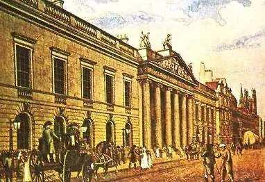
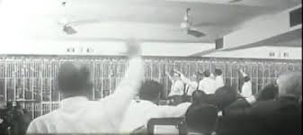
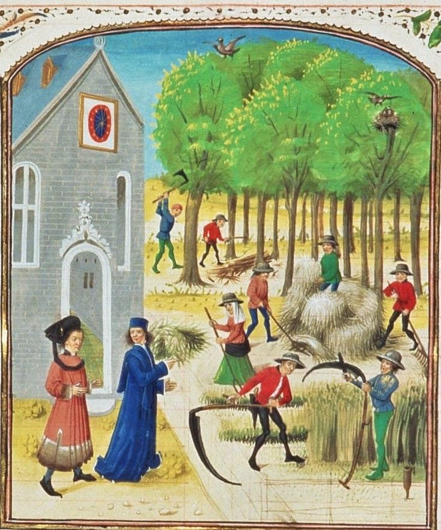
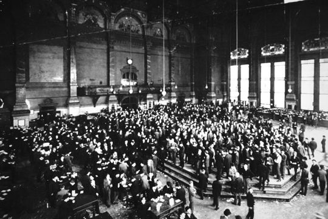

## 股票与期货的基础知识 ##

**回顾第一阶段的学习内容：**

- **创建自己的git开源仓库**
- **创建第一个py文件**
- **构建自己的函数包**

----------

**尚未完成的第二阶段内容：**

- 股票与期货的基础知识
- 简单学会看各类金融指标
- python的基础语法
- 了解html的结构
- 使用python抓取html文档

**尚未完成的第三阶段内容：**

- 介绍一些金融数据源
- 学习期权基础知识
- 开始用python抓取数据
- 设计数据库存放金融数据
- 将抓取后的python数据储存到数据库中
- 用python统计数据库中的数据

**尚未完成的第四阶段内容：**

- 设计更加精细化的数据模型
- 了解全球各大交易所的基本情况
- 第三方金融数据服务商平台
- 市场规则简介
- 一些数学公式的手工实现
- 搭建自己专属的金融数据研究实验室
- 撰写自己项目的研究白皮书

----------

让我们现在开始学习：**股票与期货的一些故事**

**一：关键历史细节**

2000多年前的古罗马共和国就有了股票和股票交易市场。当时，政府通过招标形式，把公共服务包给私人公司，这类公司的名字就叫“为公共服务的组织”。这类公司直接把股票卖给投资人，股票持有人可以把股票拿到股票市场上交易，古罗马的克斯托神庙就是股票交易的场所。古希腊历史学家波力比阿斯曾写道：“当时，几乎所有公民都持有股票”；古罗马执政官西塞罗也提到过“股票危机”，他认为当时的股票价格过高。

公元1250年前后的法国，巴扎克尔面粉公司发行了96股股票，这些股票均在市场上交易，交易价格参照面粉公司的盈利能力。

而现代股市制度的建立要归功于荷兰。1602年3月20日，总部设在阿姆斯特丹的荷兰东印度公司首次发行股票，共有1143人认购，其中还有德国人、比利时人和卢森堡人等不少外国人。该股票在阿姆斯特丹证券交易所交易，但公司每年只进行一次股东变更登记。后来报纸也每天刊登这只股票的价格，这在当时颇吸引眼球。

现在股市上常用的一些操作手段，在413年前的荷兰股市里就被使用。例如做空，就是在自认为的股票高价位借股票卖掉，等价格下跌后再买回归还，通过高价卖低价买套利；洗盘，就是合谋做空引发股市恐慌，诱导股民低价抛售股票，等价格跌到极低时再回购；对敲，就是通过多个账户自己买卖自己的股票，或几个人串通相互买卖股票，以此操作股票价格和交易量，制造市场假象；坐庄，就是囤积股票，造成供不应求假象，抬高股票价格，当股价到一定高位时出货，通过低价买高价卖套利。这些不正当的操作手段引起股市的混乱，荷兰政府便禁止做空，并开始监管股票市场。

荷兰东印度公司被荷兰议院授予各种特权，拥有军事、司法、审判、与外国统治者签订条约、发行自己的货币、建立殖民地等权力。到1669年，荷兰东印度公司拥有150条商船，40艘战舰，5万雇员，还养着一支1万人的军队，这一年公司为股民分红股息率高达40%，该公司成为当时人类历史上最富有的私人公司。在整个17世纪，荷兰东印度公司从它在亚洲的垄断专营中获得了巨大利润，连续200年向股东以18%上下的股息率分红。

1800年，荷兰东印度公司解散，其财产和债务由荷兰巴达维亚共和国（1795年到1806年期间，法兰西第一共和国在荷兰共和国上建立的傀儡国）接管。

资本主义制度的雏形源于文艺复兴时期的意大利，莎士比亚的喜剧《威尼斯商人》就描写了当时商业资本家与银行资本家之间的冲突，但荷兰人对发展和完善资本主义制度做出了巨大贡献，他们将银行、证券交易、信贷、竞拍、保险和有限责任公司等金融商业体系融合起来，极大地促进了经济的发展。

就是现在作为世界金融中心的纽约，也是荷兰人创建的，纽约建城之初叫“新阿姆斯特丹”，1664年新阿姆斯特丹被英国人夺取，并更名为“纽约”。而现在的“华尔街”的英文“Wall Street”直译就是“墙街”，荷兰人统治纽约时，那里是一堵防御墙。

**二、投资创造GDP，投机不创造GDP**

公司发行股票的目的是筹集资金，用于公司的发展。当然，公司发行股票是有条件的，例如，纽约证券交易所规定，公司过去连续3年每年盈利不得低于1000万美元，公开募集金额不得低于1亿美元，发行股数不得低于100万股。纳斯达克证券交易所规定，公司过去连续3年每年盈利不得低于1100万美元，公开募集金额不得低于7000万美元，发行股数不得低于125万股。伦敦证券交易所规定，公司过去连续3年有审计的财务报告，公开募集的金额不得低于70万英镑，公众持股量不得低于25%。

谁买了一家公司的股票，谁就是这家公司的股东，股票就成了出资证明和分红依据。当然，作为股东，在公司的权力机构股东大会上行使表决权时，一股股票就代表一个表决权。如果公司破产倒闭，股票也代表着公司清算时按持股比例分配公司残余财产。由于破产清算程序的偿付顺序股东排最后，既然公司破产已资不抵债，连债务都不能清偿，根本就剩不下什么给股东了。

我们把股票的首次发行叫股票的一级市场。如果股民在首发时买到股票，然后放到一边每年等分红，这就属于投资。投资就是把钱投入经济活动，生产商品和提供服务创造GDP。投资人的回报就是公司的盈利分配。

如果买到首发股票后，想把股票卖出去，这时的股票交易就属于股票的二级市场。我们说的炒股都是在二级市场上交易的，二级市场上的股票交易基本上都属于投机，因为买股票不是把股票放一边等分红，而是希望以后股票价格上涨卖出，通过低价买高价卖套利。投机的钱不进入经济活动，只在投机客们的腰包流转，不会创造出GDP。

**三、美国第一次股市泡沫破裂，蒸发的市值能买下整个纽约**

既然股市的二级市场主要是投机行为，风险自然很大，被炒起来的疯牛狂奔之后就奄奄一息了。

1720年，英国股民炒出来个大牛市后，终于明白了对在美洲新大陆的投资预期回报被严重高估，股民争先抛售股票，伦敦证券交易所股市崩盘。英国议会随后通过了《泡沫法案》，规定只有皇家特许的公司才有资格公开发行股票，并禁止股票二级市场交易，这一禁令几十年后才被解禁。

美国独立后第一次大规模公开发行的股票是美国银行的股票，联邦政府购买了美国银行20%的股份，其余80%的股份在社会面向公众发行，但个人持股不得超过1000股。1791年7月正式认购美国银行股票时，一个小时就被抢光了，随后价格一路攀升，并引领了美国股票历史上第一个牛市。欧洲资本也涌进纽约股票市场淘金，加速了股市泡沫的形成。

纽约证券交易所创始人之一的威廉·杜尔就是吹起股市泡沫的最主要的“操盘手”。杜尔在独立战争前是大陆会议的代表，1789年成为美国第一任财政部长亚历山大·汉密尔顿的部长助理。由于联邦法律禁止财政部官员从事证券交易，杜尔为炒股竟辞掉了让人羡慕的财政部长助理职务。

杜尔与纽约富翁亚历山大·麦克姆合作，麦克姆出资开设账户，杜尔操盘，也就是说，麦克姆出钱，杜尔出力，年终两人平分炒股获利。

杜尔主要炒纽约银行股，他在麦克姆的账户上大量购进纽约银行股，同时悄悄开了个自己的账户，利用这个账户做空纽约银行股。他是这样考虑的，如果该只股票大涨，麦克姆的账户获利，他与麦克姆平分套利；如果该只股票大跌，他自己的账户获利，套利由他自己独吞。也就是说，不管纽约银行股是涨是跌，他都是赢家。

由于杜尔过去的身份，人们把他当作股神。人们见杜尔到处借钱加仓，认为牛市要持续很久，都跟着加仓，把股市炒得如日中天。汉密尔顿对此感到震惊，他在1792年3月2日提出“应该有一个区分股票投资者和赌徒的界线”。

杜尔在股市上遇到了敌手，有人开始炒高利息反制杜尔，从银行提取大量存款，银行货币紧缺，贷款利率飙升到日息1%。杜尔炒股的钱大部分是借来的，借贷利息把他彻底压倒，因无力偿还贷款于1792年3月23日锒铛入狱，杜尔如意算盘没有打成。

杜尔入狱后，股市如溃堤般一路狂泻，不少股民一夜之间从富翁变成“负翁”，杜尔的合伙人麦克姆也于4月因破产无力还债，而入狱。

这次股市泡沫破裂，一个多月就蒸发了股民500万美元，这一数字是当时纽约房地产的总价值。

这次股灾也摧垮了银行业，银行贷出去炒股的钱无法收回，众多银行破产倒闭，最后只剩下纽约银行和美国银行纽约分行在营业。

**四、庄家遇到空头，拼个你死我活**

坐庄和做空是股市里最惊心动魄的场面，下面我们看看庄家与空头是如何拼杀的。

艾伦·莱恩是美国排名第十的富豪托马斯·莱恩的儿子。他成为纽约证券交易所的交易员后开始操作斯图兹汽车公司的股票，这只股票的价格由1920年1月初的100美元涨到1月底的120美元，并在2月2日冲高到134美元。此时，空头入场，莱恩毫不示弱开始坐庄，吞进空头（看跌）们抛出的所有股票，斯图兹股票在4月1日涨到了391美元。

由于市场上的所有斯图兹股票几乎都被莱恩收购，空头们此时傻了眼，因为他们必须向莱恩回购这只股票平仓，而他们的如意算盘是通过卖空把股价砸下去，没想到事与愿违。他们大都在130美元左右的价位卖空的，即使现在用391美元买来平仓，每股也要损失261美元，更何况莱恩绝不会以391美元的价格卖给他们，因为现在只有他手里有斯图兹股票，价格由他说了算。经过一番讨价还价，58个空头以每股550美元的价格从莱恩手里回购斯图兹股票，惨败给莱恩。

另一方面，莱恩还未来得及出货熊市来临，股票价格暴跌，莱恩手里的斯图兹股票无人接盘，由于坐庄借了大量资金，此时的他无力还贷，于1922年7月21日宣布破产，破产时的债务为32443万美元，资产仅有64万美元。最后，他手里的那堆斯图兹股票被曾是他手下的败将空头们以每股20美元的价格买走。

莱恩炒股挥霍了父亲的大笔财富，老爸一怒之下剥夺了他的继承权，真是赔了夫人又折兵。

**五、杜兰特为托市丢了通用汽车公司**

1920年初开始，美国汽车股下跌，通用汽车公司创始人威廉·杜兰特便购入大量本公司股票托市。但他的一切努力都是枉然，通用汽车公司股票从1920年初的42美元跌到同年10月底的14美元。

当时杜兰特手里并没有足够的资金托市，他便找配资炒股公司，他只交10%保证金，其余的资金由配资公司垫付，但要质押股票。股价下跌，被质押的股票贬值，配资公司不断要求杜兰特增补保证金，把杜兰特逼到山穷水尽的地步。最后还是摩根银行和杜邦公司伸出了援助之手，借给杜兰特足够的资金还清了配资公司的保证金。杜兰特炒股7个月陪了9000万美元。

最后，杜兰特把自己的300万股通用汽车公司股票作价转给了摩根银行和杜邦公司清偿债务，杜兰特为托市丢了自己的公司。离开通用汽车公司后，他靠经营一家保龄球馆勉强度过余生。让杜兰特追悔莫及的是，通用汽车公司的股票在1926年涨到了每股210美元，如果杜兰特当初不愚蠢地托市，他就是美国最富有的人。

**六、股市泡沫破裂引发上世纪美国经济“大萧条”**

1924年到1929年是美国股票历史上的一个超级大牛市。但不要忘记，要让股市牛起来，必须给它添草加料，没有大量资金注入股市，股指是涨不上来的。

当时整个美国都疯狂了，炒股赚钱太容易了，简直就是天上掉馅饼。人们到处找钱炒股，整个金融机器开足马力向股市运输资金。银行从美联储以5%的利率借钱，然后以12%的利率贷给配资炒股公司，配资炒股公司再以20%的利率贷给股民。

1929年9月3日，道琼斯工业平均指数到达了381点，这一点位在之后的25年里再也没出现过。1929年10月24日（星期四），一开盘股价狂跌。由于很多股民配资炒股，股价下跌使被质押的股票贬值，就要不断向配资公司追加保证金，股民没有闲余资金，只有甩卖股票交保证金，由此引发恶性循环：股票贬值—补充保证金—甩卖股票—股票贬值。与此同时，空头们像苍蝇闻到血腥一样出来砸盘，股价跳崖般下跌，到中午市值蒸发了95亿美元。

当时几家投资银行紧急磋商，拿出2000万美元救市，但这2000万美元投入股市犹如一个小石子投入湖泊，涟漪很快就消失了。“黑色星期四”这天股市交易量大得惊人，数据处理系统“爆表”，股票自动报价机在收盘后4个多小时仍在打印报价记录。

股市泡沫破裂后，不少股民倾家荡产，流落街头，因为为炒股向银行借贷抵押的房子被银行收走了。银行收回大量贬值的抵押资产，不管是股票还是房地产都大幅缩水，很多贷款成了坏账，储户怀疑银行的偿付能力发生挤兑潮，导致9800家银行倒闭。人类有史以来最严重的经济危机爆发了。

道琼斯工业平均指数在1932年6月8日下降到41点，与1929年股市崩盘前381点相比跌去了89.24%，又回到了1896年5月26日道琼斯工业平均指数首次在《华尔街日报》推出时的水平，牛熊轮番登场折腾了36年又回到了原点。1932年是危机最深重的一年，当时的失业率高达25%，国内生产总值仅是1929年的一半。

股市是把双刃剑，一级市场为企业融资带来便利，促进了经济的发展，二级市场的投机炒作又会从实体经济中抽走很多资金。一定时期社会上的货币是一定的，股市吸走的资金多，实体经济资金就少；如果炒出疯牛市，那就意味着社会上太多的资金急速向股市流动，导致实体经济资金不足，贷款难度增大，生产萎缩，失业率上升，经济危机爆发。

纽约证券交易所总裁理查德·惠特尼的结局也很惨，这位在股市崩盘后仍称“交易所是一个完美机构”的老兄，到1931年只剩下4万美元的资产，而债务却高达200万美元。这位昔日华尔街叱咤风云的人物靠诈骗、偷盗继续过他过惯了的奢靡生活，他偷妻子的钱，偷朋友的钱，偷客户的钱，偷公司的钱，他的银行家哥哥和富有的妻子替他偿还了偷窃的所有钱。1938年3月10日，惠特尼被捕，3月15日被保释后又从纽约游艇俱乐部盗用了15.3万美元，因为他是该俱乐部的财务主管。4月11日，他被判处5-10年的监禁，与两个敲诈勒索犯、一个抢劫犯和一个强奸犯一起被押解到外地监狱服刑。

**七、股市里谁是赢家？**

现在我们该明白了，股民一旦失去理性，股市即变为疯狂的大赌场，同时也是战场和坟场

股民心里清楚，买股票就是希望将来有个大傻瓜用更高的价格再把股票从自己的手里买走。炒股是炒不出一分钱来的，炒股赚了的钱是其他股民的钱，炒股赔了是因为其他股民把钱赚走了；有人炒股赚个盆满钵满，必定有人炒股倾家荡产；除非克制贪欲见好就收，否则股市里的股民没有赢家，今天你掏了别人腰包的钱，明天别人也会把你腰包的钱掏走。炒股的本质就是“合法的公开偷窃”。

那么，股市里有没有赢家？有，像世界的几次重大股灾，虽然股民哀鸿遍野，但像美国等国家的政府、券商和投行却是赢家。但不少股民一旦入市就有了赌徒心态，赔了要捞回来，赚了还想多赚，如此陷下去不能自拔。

拿美国来说，联邦政府征收股民的资本得利税（该税有的州还要征收一次），联邦政府的资本得利税是递进的，短期（投资一年或一年以下）资本得利税税率为10%-39.6%，与联邦个人收入所得税税率一致；长期（投资超过一年）资本得利税税率为0%-20%。当然，如果遇到派息分红，政府还征缴红利税。券商可不会免费为股民提供股票交易服务，券商对股民的每笔股票交易收取大致10-30美元的费用。所以，股票的成交量增加，意味着券商的收入增加，股民的损失增加。

**以前没有电脑的时候，人们是怎么买卖股票的？？**

股市最早出现在100多年前的美国，那时候是通过电话人工报价的。然后再通过人工记录在黑板上供股民观看。专业点的用传真机传递行情。分析行情也是手工画K线或美国线。股民交易需要在证券交易所通过填写买卖单据，由工作人员执行单上的指令。操作的时候经常出现滞后现象，

**期货的概念：**

期货市场的历史可以追索到中世纪。最初创建期货市场的目的是为了满足农民和商人的需要。假定某年5月份一位农民，他预计在9月份收获谷物的价格将会不确定。如果当时供小于求，谷物价格可能涨到很高--尤其是当农民不急于卖出谷物时，显示易见，此时农民及其家人面临着很大价格不确定的风险。

下面我们假定有一位商人对谷物有长期的需求，他也面临着很大的价格风险。在供大于求的情况下，价格对他会很有利。但是当供小于求时，价格都有可能涨得过高。这样一来，对农民和商人来说，在9月份（或更早）时见面，根据双方对9月份谷物的供求的预期而达成一个一致的价格，就很有意义。换句话说，他们可以协商制定某种类型的期货合约，这个期货合约可以消除双方各自面临的因未来价格不确定而产生的风险。

期货交易是从现货交易中远期市场发展而来的。

在互联网金融发达的21世纪，“期货”俨然成为一条不错的致富捷径。当你抱着手机电脑看期货走势时，你想过期货是怎么来的的吗？

19世纪30-40年代，美国开始了风风火火的中西部大开发行动，芝加哥作为临近中西部平原和密歇根湖的重要枢纽，自然而然成为经济的中心。然而，粮食的生产有季节性特点，等到粮食全部上市时，作为中转站的芝加哥并不具备运输全部粮食的能力。尴尬的事情发生了：由于粮食不能及时运输，导致粮仓爆满、粮食发霉，给产户带来巨大的损失。

蝴蝶效应告诉我们：产户的损失同样也是粮食经销商的损失。对此，82位芝加哥粮食商人聚在一起，想出了一个法子：采用粮食远期交易。在粮食收获的季节，他们先从农户手中收购粮食，避免丰收季节无货的尴尬。由于运输路程遥远，成本难以控制，出于利益的考虑，他们在收购粮食之后又马上与芝加哥的粮食商签订第二年春季的供货合同，事先确定销售价格，进而确保利润。

就这样，1848年芝加哥的82位商人发起组建了芝加哥期货交易所（CBOT）。并采用远期合约方式进行交易，到了1865年，又推出了标准化合约。同时实行了保证金制度，向签约双方收取不超过合约价值10%的保证金作为履约保证。这些具有历史意义的制度创新，促成了真正意义上期货交易的诞生。而投机者很快对这种合约产生了兴趣。他们发现，交易活动中合约的交易比交易谷物本身更有吸引力。

暂时介绍这么多。